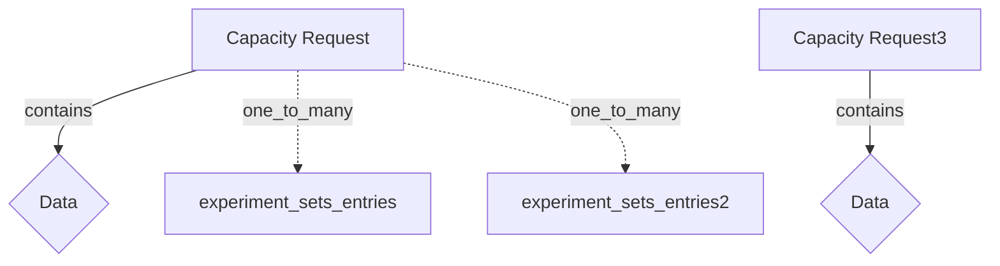

# Data Architecture Overview

*Last updated: 2025-09-18 09:18:35*

## Architecture Statistics

| Component | Count |
|-----------|-------|
| Semantic Files | 1 |
| Data Cubes | 2 |
| Joins | 2 |
| Dimensions | 1 |
| Measures | 1 |

## Data Model Diagram

## Components by File

### Semantic Output

**Data Cubes:**
- `capacity_request`: Capacity Request
- `capacity_request2`: Capacity Request3

**Relationships:**
- `experiment_sets_entries` (one_to_many)
- `experiment_sets_entries2` (one_to_many)

**Dimensions:** 1 defined

**Measures:** 1 defined
